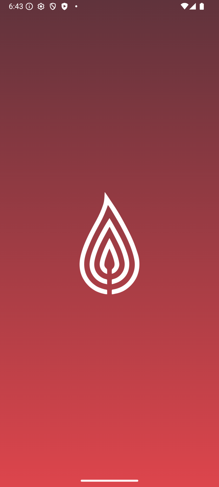

API requires VPN or location != BLR/RU

Features:

- MultiModule App
  - 
  :app - main module. responsible for app initializing
  :core-ui - themes, colors, etc, UI components
  :core:navigation-api - provides interfaces for navigation
  :core:navigation-impl - implementation of navigation as injectable object
  :core:network - network services, interceptors and serialisation
  :core:utils - utils, base classes
  :core:analytics - firebase analytics
  :core:auth - firebase auth. Login with email and google
  :core:cache - cache of the requests. Room database
  :feature:auth - identification of the user, registration, password reset/change
  :feature:movies - Now showing & coming soon movies. Details. IMDB/TRAKT Apis
  :feature:splash - check existing user, set userId for firebase and redirect
- Technologies/Frameworks:
  - 
      UI:
        - Compose
        - Material3
        - DarkMode
        - MVI
        - Coil
      DI: 
        - Hilt 
        - Hilt navigation
      Network:
        - Retrofit
        - Moshi
      Storage:
        - Room
      Other:
        - Firebase Auth, Crashlitycs, Analytics
        - MultiModule 
        - Clean Architecture
        - Pagination
        - Coroutines. Flow
- Run App
  - 
  Add to local.properties your api keys
  TRAKT_API = "{your key https://trakt.tv/}"
  TMDB_API = "Bearer {your key https://www.themoviedb.org/"
  OMDB_API = "{your key http://www.omdbapi.com/}"
- ScreenShots
  - 
  
  
  
  